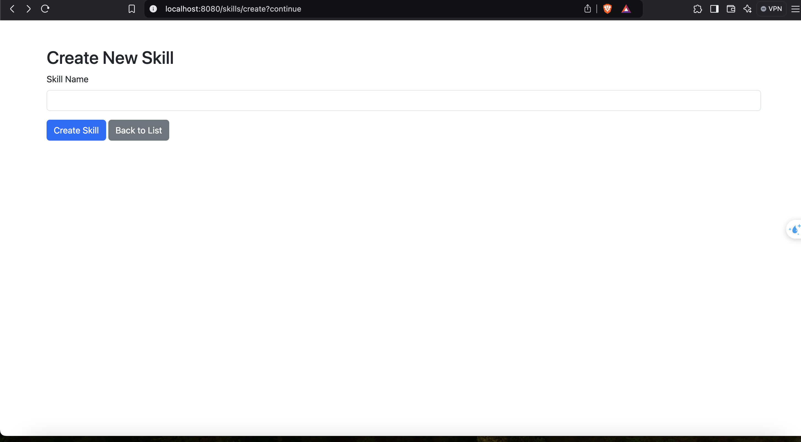

# Setup dự án

## Database
 Dùng mariadb database,
 username: root
 password: root
 database: labweek05

## Chương trình 
1. Màn hình tạo mới skills

2. Màn hình danh sách skills

3. Màn hình list jobs

4. Màn hình list jobs phân trang

5. Màn hình list jobs đang open

